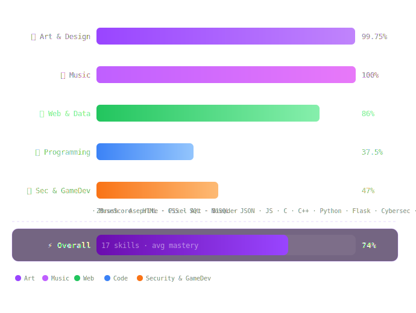

<div align="center">

[](https://github.com/SepJs)

<br>

[](https://twitter.com/SepantaJS)
&nbsp;
[](https://github.com/SepJs)
&nbsp;
[](https://sepjs.github.io/portfolio)
&nbsp;


</div>

<br>

---

<div align="center">

```
  ┌─────────────────────────────────────────────────────┐
  │                                                     │
  │   Unknown XRG  ·  Sepanta                           │
  │                                                     │
  │   Game Developer  ·  Programmer  ·  Digital Artist  │
  │   Creator of INNER VOID                             │
  │   Harvard Online Student                            │
  │                                                     │
  │   "Turning the void into worlds."                   │
  │                                                     │
  └─────────────────────────────────────────────────────┘
```

</div>

---

> [!CAUTION]
> ## About

>I don't fit into a single category — and that's intentional.

I'm a **Game Developer**, **Systems Programmer**, and **Digital Artist** architecting experiences across the full creative stack. From low-level memory management in **C/C++** to digital sculpting in **ZBrush**, from technical logic in **Godot (GDScript)** to crafting modern dynamic UI/UX — I look at products holistically.

As the founder of **INNER VOID STUDIO**, I lead the development of immersive, atmospheric experiences, balancing core technical game logic with strict aesthetic direction. 

Currently expanding my theoretical foundations in computer science through **Harvard Online**.

>I build things that didn't exist before. That's the only metric that matters.

---

## Skills

<div align="center">

[](https://skillicons.dev)

<br>


</div>

---

## Skill Mastery

```
  Art & Design ───────────────────────────────────────────
ZBrush & Sculpting     ████████████████████████████████  Advanced / Production-Ready
Aseprite & Pixel Art   ████████████████████████████████  Advanced / Production-Ready
Blender 3D Asset Dev   ██████████████████████████████  Advanced

Architecture & Web ─────────────────────────────────────
Databases (SQL/NoSQL)  ████████████████████████████████  Advanced
HTML5 / CSS3 / Tailwind████████████████████████████████  Advanced
JavaScript / Core DOM  ██████████████                    Intermediate

Systems & Engines ──────────────────────────────────────
Cybersecurity Concepts ████████████████████████          Intermediate
C / C++ Core Logic     ██████████████████████            Intermediate
Godot Engine & GDScript██████████████████████            Intermediate
Python & Flask APIs    ████████████████                  Intermediate
```

<br>

<div align="center">

| Category | Skills | Avg |
|:---|:---|:---:|
| 🎨 Art & Design | ZBrush · Aseprite · Pixel Art · Blender |  |
| 🎵 Music | MuseScore |  |
| 🌐 Web & Data | HTML · CSS · SQL · NoSQL · JSON · JS |  |
| 💻 Programming | C · C++ · Python · Flask |  |
| 🔐 Security & Game Dev | Cybersecurity · Godot |  |
| **⚡ Overall** | **17 skills** |  |

</div>

<br>

<div align="center">
  
</div>

---

## INNER VOID

<div align="center">

> *"The void was never empty. It was waiting."*

A game forged from nothing — built with **Godot**, sculpted in **ZBrush & Blender**, brought to life pixel by pixel in **Aseprite**, scored in **MuseScore**.

</div>

---

## 🗂️ Projects

### 🌐 Front-End

<div align="center">

<br>

<sub>✦ FRONT-END SHOWCASE ✦</sub>

<br>

━━━━━━━━━━━━━━━━━━━━━━━━━━━━━━━━━━━━━━━━

*A curated collection of front-end work — built from scratch, designed with intention.*
*Clean interfaces, smooth interactions, and code that actually makes sense.*
**This is where ideas become experiences.**

━━━━━━━━━━━━━━━━━━━━━━━━━━━━━━━━━━━━━━━━

<br>


<br>

</div>

---

### 🛢️ Back-End

<div align="center">

<br>

<sub>✦ BACK-END SHOWCASE ✦</sub>

<br>

━━━━━━━━━━━━━━━━━━━━━━━━━━━━━━━━━━━━━━━━

*Solid back-end foundations — from relational databases to lightweight APIs.*
*Data that's structured, queries that are clean, and logic that actually holds.*
**The engine behind the experience.**

━━━━━━━━━━━━━━━━━━━━━━━━━━━━━━━━━━━━━━━━

<br>


<br>

</div>

---

### 🔐 Security

<div align="center">

<br>

<sub>✦ SECURITY SHOWCASE ✦</sub>

<br>

━━━━━━━━━━━━━━━━━━━━━━━━━━━━━━━━━━━━━━━━

*Security isn't an afterthought — it's a mindset.*
*Low-level code, offensive tooling, and a deep understanding of how systems break.*
**Built to understand. Hardened to protect.**

━━━━━━━━━━━━━━━━━━━━━━━━━━━━━━━━━━━━━━━━

<br>


<br>

</div>

---

### 🎮 Game Development

<div align="center">

<br>

<sub>✦ GAME DEV SHOWCASE ✦</sub>

<br>

━━━━━━━━━━━━━━━━━━━━━━━━━━━━━━━━━━━━━━━━

*Games are the intersection of every discipline I know.*
*Code, art, sound, and design — all converging into a single interactive world.*
**This is where everything comes together.**

━━━━━━━━━━━━━━━━━━━━━━━━━━━━━━━━━━━━━━━━

<br>


<br>

</div>

---

## GitHub Stats

<div align="center">

<a href="https://github.com/SepJs"></a>
<a href="https://github.com/SepJs"></a>
<a href="https://github.com/SepJs"></a>

</div>

---

## Trophies

<div align="center">

[](https://github.com/ryo-ma/github-profile-trophy)

</div>

---

<div align="center">

[](https://github.com/SepJs)
&nbsp;
[](https://twitter.com/SepantaJS)

<br><br>

[](https://github.com/SepJs)

</div>
